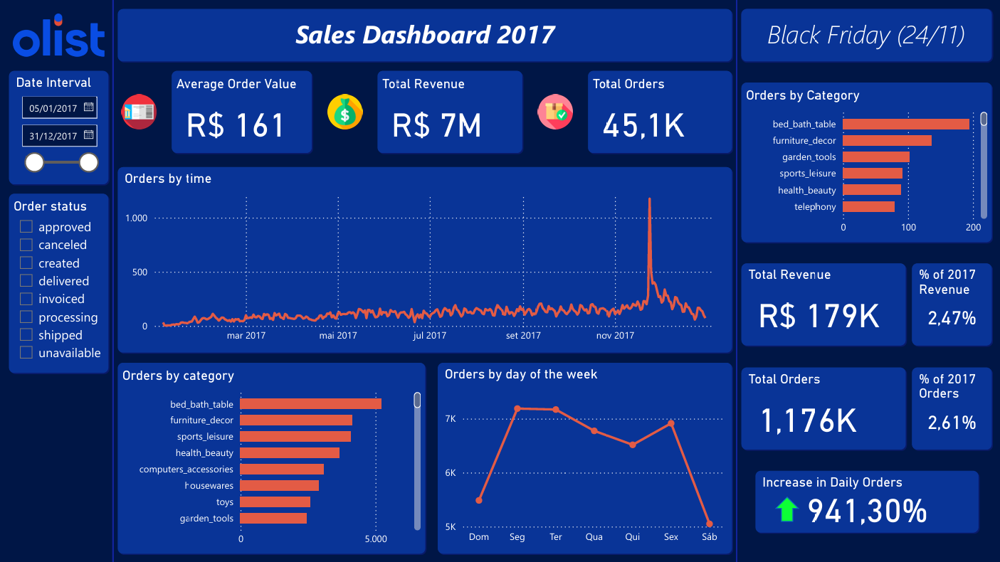

# Creating a dashboard in PowerBI

This was a project designed by myself to practice my Data Analyst skills.

The data was taken from Kaggle (https://www.kaggle.com/datasets/olistbr/brazilian-ecommerce?select=olist_order_reviews_dataset.csv), it is a popular brazilian sales dataset provided by Olist.

My objective was to build an interactive dashboard that highlights key insights derived from this rich dataset. To guide the analysis, I focused on answering common business questions, such as:

- **What is the total revenue?**
- **How many orders were placed overall?**
- **What is the average order value (AOV)?**
- **Which day of the week has the highest number of orders?**
- **What are the top-selling product categories?**

I also created a set of visuals to enhance the analysis.
While plotting Sales over Time, the impact of Black Friday stood out as particularly striking. This led me to dive deeper and extract insights related to that key retail period, which holds great importance for many businesses.

As an additional exercise, I replicated the same analyses using SQLite.
The corresponding SQL queries can be found in the sql-scripts/dashboard-queries directory of this repository.

Here's the dashboard:

So if we go back to the initial questions...

- **What is the total revenue?** The total revenue from the year 2017 is ~7 million BRL.

- **How many orders were placed overall?** The total amount of orders was roughly 45.1K.

- **What is the average order value (AOV)?** The calculated AOV is 161 BRL.

- **Which day of the week has the highest number of orders?** We can see the highest amount of orders were made on monday, with tuesday close second.

- **What are the top-selling product categories?** The top 3 selling product categories are bed_bath_table, furniture_decor and sports_leisure.

Let us review some data from Black Friday.

- **Total Revenue:** 179K, 2.47% of total revenue from 2017.
- **Amount of Orders:** 1176, 2.61% of total revenue from 2017.
- **Increase in daily orders:** 941.3%. That means that one particular day produced roughly more than 9 days in average.